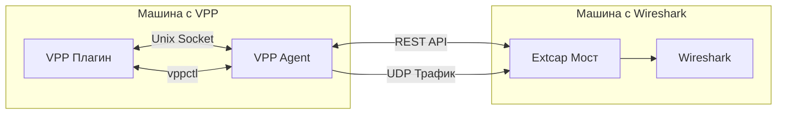
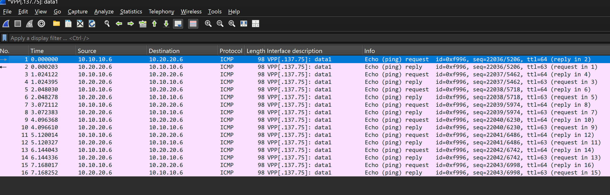

# VPP to Wireshark Bridge

[](LICENSE-2.0.txt)
[](https://github.com/wapxmas/vpp_wireshark_bridge/releases/)
[](https://github.com/wapxmas/vpp_wireshark_bridge/graphs/commit-activity)

> *Мост между VPP (Vector Packet Processing, fd.io) и Wireshark, позволяющий просматривать трафик с интерфейсов VPP в Wireshark через интерфейс extcap, даже если VPP и Wireshark находятся на разных машинах.*

[English](README_EN.md) | Русский

<div align="center">
  <h1 style="font-size: 36px; font-weight: bold; color: #2c3e50;">
    🔄 VPP to Wireshark Bridge
  </h1>
</div>

## 📋 Содержание
- [Краткий обзор](#краткий-обзор)
- [Особенности](#особенности)
- [Архитектура](#архитектура)
- [Типы соединений](#типы-соединений)
- [Требования](#требования)
- [Быстрый старт](#быстрый-старт)
- [Установка](#установка)
  - [Установка плагина VPP](#установка-плагина-vpp)
  - [Установка VPP агента](#установка-vpp-агента)
  - [Установка Python моста](#установка-python-моста)
- [Использование](#использование)
  - [Управление через vppctl](#прямое-управление-через-vppctl)
  - [Запуск VPP агента](#запуск-vpp-агента)
  - [Использование в Wireshark](#использование-в-wireshark)
  - [Управление через REST API](#управление-через-rest-api)
- [Отладка](#отладка)
- [Часто задаваемые вопросы (FAQ)](#часто-задаваемые-вопросы-faq)
- [Устранение неполадок](#устранение-неполадок)
- [Вклад в проект](#вклад-в-проект)
- [Авторы](#авторы)
- [Лицензия](#лицензия)

## 🚀 Краткий обзор

VPP to Wireshark Bridge — это инструмент, позволяющий анализировать трафик интерфейсов VPP в Wireshark в реальном времени. Он состоит из трех компонентов:

1. **Плагин VPP** - перехватывает трафик интерфейсов и отправляет его в мост
2. **VPP агент** - предоставляет REST API для управления и информацию об интерфейсах
3. **Python мост** - передает трафик от плагина VPP в Wireshark через extcap

## 🏗️ Архитектура



<div align="center">

</div>

## 🔌 Типы соединений

Плагин VPP поддерживает два типа подключений для передачи перехваченных пакетов:

| Тип соединения | Описание | Пример | Рекомендуется для |
|----------------|----------|--------|-------------------|
| **TCP соединение** | Стандартное TCP соединение по IP и порту | `192.168.1.100:9000` | Обычное окружение |
| **Unix сокеты** | Локальные Unix-сокеты для быстрой передачи | `/var/run/wireshark.sock` | VPP внутри отдельного namespace |

## 📋 Требования

- VPP (fd.io) 21.01 или выше
- Wireshark 3.4 или выше
- Python 3.6 или выше
- Для Windows: pywin32 для поддержки именованных каналов

## 🚀 Быстрый старт

```bash
# 1. Клонировать репозиторий
git clone https://github.com/wapxmas/vpp_wireshark_bridge.git
cd vpp_wireshark_bridge

# 2. Установить зависимости
pip install -r vpp_agent/requirements.txt
pip install -r extcap_bridge/requirements.txt

# 3. Запустить VPP агент (на машине с VPP)
./vpp_agent/vpp_agent.py --host 0.0.0.0 --port 8080

# 4. Установить extcap мост для Wireshark (на машине с Wireshark)
# Подробные инструкции в разделе "Установка Python моста"

# 5. Открыть Wireshark и выбрать интерфейс VPP для захвата
```

## 📦 Установка

### Установка плагина VPP

1. Скопируйте директорию `vpp_plugin/wireshark_bridge` в директорию `src/plugins` вашего исходного кода VPP.
2. Добавьте `wireshark_bridge` в список плагинов в файле `src/plugins/CMakeLists.txt`:
   ```cmake
   add_subdirectory(wireshark_bridge)
   ```
3. Пересоберите VPP:
   ```bash
   make build
   make install
   ```

### Установка VPP агента

1. Скопируйте директорию `vpp_agent` на машину с VPP.
2. Установите необходимые зависимости:
   ```bash
   pip install -r vpp_agent/requirements.txt
   ```
3. Сделайте файл агента исполняемым:
   ```bash
   chmod +x vpp_agent/vpp_agent.py
   ```
4. Запустите агент:
   ```bash
   ./vpp_agent/vpp_agent.py --host 0.0.0.0 --port 8080 --debug
   ```

#### Параметры запуска VPP агента

| Параметр | Описание | Значение по умолчанию |
|----------|----------|------------------------|
| `--host IP` | IP-адрес для прослушивания | 0.0.0.0 |
| `--port PORT` | Порт для прослушивания | 8080 |
| `--debug` | Включить детальное логирование | False |
| `--vppcmd COMMAND` | Команда для взаимодействия с VPP | vppctl |
| `--unix-socket PATH` | Путь к Unix-сокету для прокси-соединения | None |
| `--bridge-address ADDR` | Адрес моста для прокси-соединения | None |

### Установка Python моста

<details>
<summary>Инструкция для Linux</summary>

```bash
# Создание отдельного каталога для Python скрипта и виртуального окружения
mkdir -p ~/vpp_wireshark_bridge
cp extcap_bridge/vpp_extcap_bridge.py ~/vpp_wireshark_bridge/
cd ~/vpp_wireshark_bridge/
python3 -m venv .env
source .env/bin/activate
pip install -r /путь/к/extcap_bridge/requirements.txt
deactivate

# Копирование wrapper-скрипта в директорию extcap
# Для x86_64 архитектуры:
sudo cp extcap_bridge/vpp_bridge_wrapper.sh /usr/lib/wireshark/extcap/
sudo chmod +x /usr/lib/wireshark/extcap/vpp_bridge_wrapper.sh

# Для ARM64 архитектуры:
sudo cp extcap_bridge/vpp_bridge_wrapper.sh /usr/lib/aarch64-linux-gnu/wireshark/extcap/
sudo chmod +x /usr/lib/aarch64-linux-gnu/wireshark/extcap/vpp_bridge_wrapper.sh
```
</details>

<details>
<summary>Инструкция для macOS</summary>

```bash
# Создание отдельного каталога для Python скрипта и виртуального окружения
mkdir -p ~/vpp_wireshark_bridge
cp extcap_bridge/vpp_extcap_bridge.py ~/vpp_wireshark_bridge/
cd ~/vpp_wireshark_bridge/
python3 -m venv .env
source .env/bin/activate
pip install -r /путь/к/extcap_bridge/requirements.txt
deactivate

# Копирование wrapper-скрипта в директорию extcap
sudo cp extcap_bridge/vpp_bridge_wrapper.sh /Applications/Wireshark.app/Contents/MacOS/extcap/
sudo chmod +x /Applications/Wireshark.app/Contents/MacOS/extcap/vpp_bridge_wrapper.sh
```
</details>

<details>
<summary>Инструкция для Windows</summary>

```batch
REM Создание отдельного каталога для Python скрипта и виртуального окружения
mkdir "%USERPROFILE%\vpp_wireshark_bridge"
copy extcap_bridge\vpp_extcap_bridge.py "%USERPROFILE%\vpp_wireshark_bridge\"
cd "%USERPROFILE%\vpp_wireshark_bridge"
python -m venv .env
.env\Scripts\activate
pip install -r путь\к\extcap_bridge\requirements.txt
deactivate

REM Копирование wrapper-скрипта в директорию extcap
copy extcap_bridge\vpp_bridge_wrapper.bat "%APPDATA%\Wireshark\extcap\"
```
</details>

## 🔧 Использование

### Прямое управление через vppctl

<details>
<summary>Примеры команд vppctl</summary>

```bash
# Включение передачи трафика для интерфейса через TCP сокет (IP:порт)
vppctl wireshark bridge enable GigabitEthernet0/0/0 192.168.1.100:9000

# Включение передачи трафика для интерфейса через Unix сокет
vppctl wireshark bridge enable GigabitEthernet0/0/0 /var/run/wireshark.sock

# Включение передачи только входящего трафика через TCP сокет
vppctl wireshark bridge enable GigabitEthernet0/0/0 192.168.1.100:9000 rx

# Отключение передачи трафика для интерфейса
vppctl wireshark bridge disable GigabitEthernet0/0/0

# Просмотр статистики передачи трафика
vppctl wireshark bridge stats
```
</details>

### Запуск VPP агента

```bash
# На машине с VPP
./vpp_agent/vpp_agent.py --host 0.0.0.0 --port 8080 --debug
```

### Использование в Wireshark

1. Запустите Wireshark.
2. В списке интерфейсов вы увидите интерфейсы VPP.
3. Выберите нужный интерфейс.
4. Нажмите "Start" для начала захвата пакетов.

### Управление через REST API

<details>
<summary>Примеры запросов REST API</summary>

```bash
# Получение списка интерфейсов
curl http://vpp-host:8080/interfaces

# Включение передачи трафика через TCP сокет (оба направления)
curl -X POST -H "Content-Type: application/json" -d '{"interface":"GigabitEthernet0/0/0","bridge_address":"wireshark-host:9000","direction":"both"}' http://vpp-host:8080/enable

# Отключение передачи трафика
curl -X POST -H "Content-Type: application/json" -d '{"interface":"GigabitEthernet0/0/0"}' http://vpp-host:8080/disable

# Получение статистики
curl http://vpp-host:8080/stats
```
</details>

## 🐞 Отладка

<details>
<summary>Отладка VPP агента</summary>

```bash
./vpp_agent/vpp_agent.py --debug
```

Логи сохраняются в стандартный вывод.
</details>

<details>
<summary>Отладка Python моста</summary>

```bash
python3 extcap_bridge/vpp_extcap_bridge.py --debug --vpp-host=vpp-host --vpp-port=8080 --direction=both --capture --interface=vpp_1 --fifo=/tmp/wireshark_pipe
```

Логи сохраняются в файл `vpp_extcap_bridge.log` в директории временных файлов.
</details>

<details>
<summary>Инструменты отладки</summary>

**UDP Listener (utils/udp_listener.py)** - утилита для приема и отображения UDP-пакетов:
```bash
python3 utils/udp_listener.py --port 9000 --show-hex
```
</details>

## ❓ Часто задаваемые вопросы (FAQ)

<details>
<summary>Q: Как проверить, что VPP агент работает корректно?</summary>

A: Выполните запрос к API для получения списка интерфейсов:
```bash
curl http://vpp-host:8080/interfaces
```
Вы должны увидеть список доступных интерфейсов VPP.
</details>

<details>
<summary>Q: Какое минимальное влияние на производительность VPP оказывает плагин?</summary>

A: Плагин оптимизирован для минимального влияния на основную функциональность VPP. В наших тестах производительность снижается не более чем на 1-2% при включенном плагине.
</details>

<details>
<summary>Q: Поддерживается ли захват трафика на виртуальных интерфейсах?</summary>

A: Да, плагин поддерживает захват трафика на всех типах интерфейсов VPP, включая виртуальные.
</details>

## 🔧 Устранение неполадок

<details>
<summary>Проблема: Интерфейсы VPP не отображаются в Wireshark</summary>

**Решение:**
1. Убедитесь, что VPP агент запущен и доступен по сети.
2. Проверьте путь к скрипту в wrapper-файле.
3. Проверьте настройки брандмауэра.
4. Перезапустите Wireshark.
</details>

<details>
<summary>Проблема: Пакеты не передаются от VPP к Wireshark</summary>

**Решение:**
1. Убедитесь, что передача трафика включена для выбранного интерфейса.
2. Проверьте, что на интерфейсе есть активный трафик.
3. Проверьте доступность UDP-соединения между машинами.
4. Проверьте логи VPP агента и моста.
</details>

<details>
<summary>Проблема: UDP-пакеты блокируются на Windows</summary>

**Решение:**
Добавьте правило брандмауэра, разрешающее входящий UDP-трафик:
```batch
netsh advfirewall firewall add rule name="Allow UDP Port 9000" dir=in action=allow protocol=UDP localport=9000
```
</details>

## 💻 Вклад в проект

Вклады приветствуются! Пожалуйста, следуйте этим шагам:

1. Форкните репозиторий
2. Создайте ветку для вашей фичи (`git checkout -b feature/amazing-feature`)
3. Зафиксируйте изменения (`git commit -m 'Add amazing feature'`)
4. Отправьте изменения в вашу ветку (`git push origin feature/amazing-feature`)
5. Откройте Pull Request

Более подробную информацию см. в файле [CONTRIBUTING.md](CONTRIBUTING.md).

## 👥 Авторы

* **Сергей Яшин** - *Начальная работа* - [GitHub профиль](https://github.com/wapxmas)

Смотрите также список [участников](https://github.com/wapxmas/vpp_wireshark_bridge/contributors), которые внесли свой вклад в этот проект.

## 📄 Лицензия

Этот проект лицензирован под Apache License 2.0 - см. файл [LICENSE](LICENSE-2.0.txt) для подробностей.

---

<div align="center">
🌟 <a href="https://github.com/wapxmas/vpp_wireshark_bridge">Поставьте звезду на GitHub</a> и следите за обновлениями! 🌟
</div> 