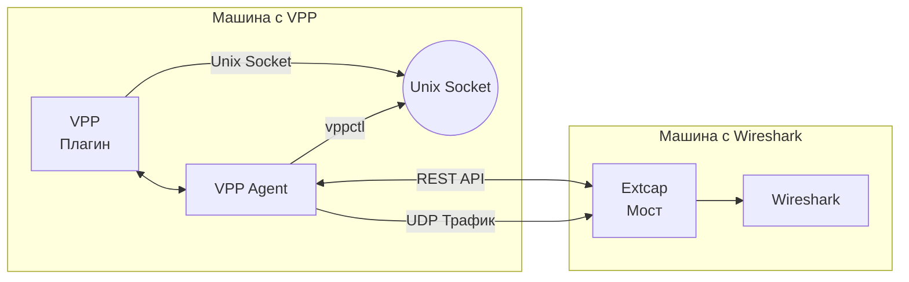

# VPP to Wireshark Bridge (Python Version)

Мост между VPP (Vector Packet Processing, fd.io) и Wireshark, позволяющий просматривать трафик с интерфейсов VPP в Wireshark через интерфейс extcap, даже если VPP и Wireshark находятся на разных машинах.

## Описание

Данный проект состоит из трех основных компонентов:

1. **Плагин VPP** - плагин для VPP, который перехватывает трафик с интерфейсов и отправляет его в мост.
2. **VPP агент** - приложение на Python, которое работает на машине с VPP и предоставляет REST API для управления плагином и получения информации об интерфейсах.
3. **Python мост** - приложение на Python, которое работает на машине с Wireshark, получает трафик от плагина VPP и передает его в Wireshark через интерфейс extcap.

## Особенности

- Плагин VPP передает список интерфейсов, с которых можно захватывать трафик
- Функционал плагина включается и отключается через vppctl или через REST API агента
- Мост написан на Python для простоты разработки и отладки
- Поддержка всех типов интерфейсов VPP
- Поддержка работы VPP и Wireshark на разных машинах
- Поддержка TCP сокетов (IP:порт) и Unix сокетов (/путь/к/сокету)
- Простая установка и настройка
- Кроссплатформенная поддержка (Linux, macOS, Windows)
- Потоковая передача трафика в режиме реального времени с минимальной задержкой
- Настраиваемые параметры соединения для оптимальной производительности

## Архитектура



## Типы соединений

Плагин VPP поддерживает два типа подключений для передачи перехваченных пакетов:

1. **TCP соединение** - стандартное TCP соединение по IP-адресу и порту (например, 192.168.1.100:9000)
2. **Unix сокеты** - локальные Unix-сокеты для более быстрой передачи данных на той же машине (например, /var/run/wireshark.sock)

Использование Unix сокетов рекомендуется, когда VPP и Wireshark работают на одной машине, так как это обеспечивает более высокую производительность и надежность.

## Требования

- VPP (fd.io) 21.01 или выше
- Wireshark 3.4 или выше
- Python 3.6 или выше
- Для Windows: дополнительные Python-библиотеки pywin32 для поддержки именованных каналов

## Структура проекта

Проект имеет следующую структуру файлов:

```
vpp_wireshark_bridge/
├── vpp_plugin/               # Плагин VPP
│   └── wireshark_bridge/     
│       ├── wireshark_bridge.c  # Код плагина
│       ├── wireshark_bridge.api # API определения
│       └── CMakeLists.txt     # Файл сборки
├── vpp_agent/                # VPP агент
│   ├── vpp_agent.py          # Код агента
│   └── requirements.txt      # Зависимости Python
├── extcap_bridge/            # Extcap мост для Wireshark
│   ├── vpp_extcap_bridge.py  # Основной код моста
│   ├── vpp_bridge_wrapper.sh # Скрипт-обертка для Linux/macOS
│   ├── vpp_bridge_wrapper.bat # Скрипт-обертка для Windows
│   └── requirements.txt      # Зависимости Python
└── utils/                     # Утилиты
    └── udp_listener.py        # Инструмент для отладки трафика
```

## Установка

### Установка плагина VPP

1. Скопируйте директорию `vpp_plugin/wireshark_bridge` в директорию `src/plugins` вашего исходного кода VPP.
2. Добавьте `wireshark_bridge` в список плагинов в файле `src/plugins/CMakeLists.txt`:
   ```cmake
   add_subdirectory(wireshark_bridge)
   ```
3. Пересоберите VPP:
   ```bash
   make build
   make install
   ```

### Установка VPP агента

1. Скопируйте директорию `vpp_agent` на машину с VPP.
2. Установите необходимые зависимости:
   ```bash
   pip install -r vpp_agent/requirements.txt
   ```
3. Сделайте файл агента исполняемым:
   ```bash
   chmod +x vpp_agent/vpp_agent.py
   ```
4. Запустите агент:
   ```bash
   ./vpp_agent/vpp_agent.py --host 0.0.0.0 --port 8080 --debug
   ```

#### Параметры запуска VPP агента

VPP агент поддерживает следующие параметры командной строки:

```
--host IP           - IP-адрес для прослушивания (по умолчанию: 0.0.0.0)
--port PORT         - Порт для прослушивания (по умолчанию: 8080)
--debug             - Включить детальное логирование для отладки
--vppcmd COMMAND    - Команда для взаимодействия с VPP (по умолчанию: vppctl)
                      Может быть полным путем к vppctl или сложной командой
                      Примеры: /usr/bin/vppctl, "docker exec vpp.vpp vppctl"
--unix-socket PATH  - Путь к Unix-сокету для прокси-соединения
--bridge-address ADDR - Адрес моста для прокси-соединения
```

Примеры запуска:

```bash
# Базовый запуск с настройками по умолчанию
./vpp_agent/vpp_agent.py

# Запуск с указанием хоста и порта
./vpp_agent/vpp_agent.py --host 192.168.1.100 --port 9090

# Запуск с включенной отладкой
./vpp_agent/vpp_agent.py --debug

# Запуск при использовании VPP в контейнере Docker
./vpp_agent/vpp_agent.py --vppcmd "docker exec vpp.vpp vppctl"

# Запуск с настройкой прокси для Unix-сокета
./vpp_agent/vpp_agent.py --unix-socket /var/run/wireshark/vpp.sock --bridge-address wireshark-host:9000
```

### Установка Python моста

1. Убедитесь, что у вас установлен Python 3.6 или выше:
   ```bash
   python3 --version
   ```
2. Установите необходимые зависимости:
   ```bash
   pip install -r extcap_bridge/requirements.txt
   ```
3. Установите мост в директорию extcap Wireshark:
   ```bash
   # Создание отдельного каталога для Python скрипта и виртуального окружения
   # Для Linux
   mkdir -p ~/vpp_wireshark_bridge
   cp extcap_bridge/vpp_extcap_bridge.py ~/vpp_wireshark_bridge/
   cd ~/vpp_wireshark_bridge/
   python3 -m venv .env
   source .env/bin/activate
   pip install -r /путь/к/extcap_bridge/requirements.txt
   deactivate
   
   # Копирование только wrapper-скрипта в директорию extcap
   sudo cp extcap_bridge/vpp_bridge_wrapper.sh /usr/lib/wireshark/extcap/
   sudo chmod +x /usr/lib/wireshark/extcap/vpp_bridge_wrapper.sh
   
   # Для macOS
   mkdir -p ~/vpp_wireshark_bridge
   cp extcap_bridge/vpp_extcap_bridge.py ~/vpp_wireshark_bridge/
   cd ~/vpp_wireshark_bridge/
   python3 -m venv .env
   source .env/bin/activate
   pip install -r /путь/к/extcap_bridge/requirements.txt
   deactivate
   
   # Копирование только wrapper-скрипта в директорию extcap
   sudo cp extcap_bridge/vpp_bridge_wrapper.sh /Applications/Wireshark.app/Contents/MacOS/extcap/
   sudo chmod +x /Applications/Wireshark.app/Contents/MacOS/extcap/vpp_bridge_wrapper.sh
   
   # Для Windows
   mkdir "%USERPROFILE%\vpp_wireshark_bridge"
   copy extcap_bridge\vpp_extcap_bridge.py "%USERPROFILE%\vpp_wireshark_bridge\"
   cd "%USERPROFILE%\vpp_wireshark_bridge"
   python -m venv .env
   .env\Scripts\activate
   pip install -r путь\к\extcap_bridge\requirements.txt
   deactivate
   
   # Копирование только wrapper-скрипта в директорию extcap
   copy extcap_bridge\vpp_bridge_wrapper.bat "%APPDATA%\Wireshark\extcap\"
   ```

4. Отредактируйте скрипт-обертку (vpp_bridge_wrapper.sh или vpp_bridge_wrapper.bat) для указания правильных путей и настроек:
   ```bash
   # Укажите путь к директории с extcap мостом
   PY_BRIDGE_SCRIPT_DIR="$HOME/vpp_wireshark_bridge"  # Для Linux/macOS
   # PY_BRIDGE_SCRIPT_DIR="%USERPROFILE%\vpp_wireshark_bridge"  # Для Windows
   # Активация виртуального окружения
   VENV_ACTIVATE="${PY_BRIDGE_SCRIPT_DIR}/.env/bin/activate"  # Для Linux/macOS
   # VENV_ACTIVATE="${PY_BRIDGE_SCRIPT_DIR}\.env\Scripts\activate"  # Для Windows
   # Укажите IP-адрес машины с VPP
   VPP_HOST="192.168.1.100"
   # Укажите порт VPP агента
   VPP_PORT="8080"
   ```

5. Проверка корректности установки:
   ```bash
   # Для Linux/macOS
   /usr/lib/wireshark/extcap/vpp_bridge_wrapper.sh --extcap-interfaces
   # или для macOS
   /Applications/Wireshark.app/Contents/MacOS/extcap/vpp_bridge_wrapper.sh --extcap-interfaces
   
   # Для Windows
   "%APPDATA%\Wireshark\extcap\vpp_bridge_wrapper.bat" --extcap-interfaces
   ```
   
   При успешной установке вы увидите список интерфейсов, например:
   ```
   extcap {version=1.0.0}{help=https://fd.io/vpp/}
   interface {value=vpp_1}{display=VPP[.137.75]: data1}
   interface {value=vpp_2}{display=VPP[.137.75]: data2}
   interface {value=vpp_0}{display=VPP[.137.75]: local0}
   interface {value=vpp_3}{display=VPP[.137.75]: tap1}
   ```

## Использование

### Прямое управление через vppctl

Вы можете напрямую управлять плагином через vppctl:

```bash
# Включение передачи трафика для интерфейса через TCP сокет (IP:порт)
vppctl wireshark bridge enable GigabitEthernet0/0/0 192.168.1.100:9000

# Включение передачи трафика для интерфейса через Unix сокет
vppctl wireshark bridge enable GigabitEthernet0/0/0 /var/run/wireshark.sock

# Включение передачи только входящего трафика через TCP сокет
vppctl wireshark bridge enable GigabitEthernet0/0/0 192.168.1.100:9000 rx

# Включение передачи только входящего трафика через Unix сокет
vppctl wireshark bridge enable GigabitEthernet0/0/0 /var/run/wireshark.sock rx

# Включение передачи только исходящего трафика через TCP сокет
vppctl wireshark bridge enable GigabitEthernet0/0/0 192.168.1.100:9000 tx

# Включение передачи только исходящего трафика через Unix сокет
vppctl wireshark bridge enable GigabitEthernet0/0/0 /var/run/wireshark.sock tx

# Включение передачи трафика в обоих направлениях (по умолчанию)
vppctl wireshark bridge enable GigabitEthernet0/0/0 192.168.1.100:9000 both
# или для Unix сокета
vppctl wireshark bridge enable GigabitEthernet0/0/0 /var/run/wireshark.sock both

# Отключение передачи трафика для интерфейса
vppctl wireshark bridge disable GigabitEthernet0/0/0

# Просмотр статистики передачи трафика
vppctl wireshark bridge stats

# Просмотр статистики для конкретного интерфейса
vppctl wireshark bridge stats GigabitEthernet0/0/0
```

### Запуск VPP агента

```bash
# На машине с VPP
./vpp_agent/vpp_agent.py --host 0.0.0.0 --port 8080 --debug
```

### Использование в Wireshark

1. Запустите Wireshark.
2. В списке интерфейсов вы увидите интерфейсы VPP.
3. Выберите нужный интерфейс.
4. Нажмите "Start" для начала захвата пакетов.

### Управление через REST API

Вы также можете управлять передачей трафика через REST API агента:

```bash
# Получение списка интерфейсов
curl http://vpp-host:8080/interfaces

# Включение передачи трафика через TCP сокет (оба направления)
curl -X POST -H "Content-Type: application/json" -d '{"interface":"GigabitEthernet0/0/0","bridge_address":"wireshark-host:9000","direction":"both"}' http://vpp-host:8080/enable

# Включение передачи трафика через Unix сокет (оба направления)
curl -X POST -H "Content-Type: application/json" -d '{"interface":"GigabitEthernet0/0/0","bridge_address":"/var/run/wireshark.sock","direction":"both"}' http://vpp-host:8080/enable

# Включение передачи только входящего трафика через TCP сокет
curl -X POST -H "Content-Type: application/json" -d '{"interface":"GigabitEthernet0/0/0","bridge_address":"wireshark-host:9000","direction":"rx"}' http://vpp-host:8080/enable

# Включение передачи только исходящего трафика через TCP сокет
curl -X POST -H "Content-Type: application/json" -d '{"interface":"GigabitEthernet0/0/0","bridge_address":"wireshark-host:9000","direction":"tx"}' http://vpp-host:8080/enable

# Отключение передачи трафика
curl -X POST -H "Content-Type: application/json" -d '{"interface":"GigabitEthernet0/0/0"}' http://vpp-host:8080/disable

# Получение статистики
curl http://vpp-host:8080/stats

# Выполнение произвольной команды VPP
curl -X POST -H "Content-Type: application/json" -d '{"command":"show interface"}' http://vpp-host:8080/command
```

## Настройка Unix сокета для Wireshark

Для использования Unix сокета необходимо обеспечить наличие Unix-сокета и правильные права доступа к нему:

1. Убедитесь, что директория для сокета существует и имеет правильные права доступа:
   ```bash
   sudo mkdir -p /var/run/wireshark/
   sudo chmod 777 /var/run/wireshark/
   ```

2. Запустите мост с указанием Unix сокета:
   ```bash
   python3 vpp_extcap_bridge.py --unix-socket=/var/run/wireshark/vpp.sock --server
   ```

3. Включите передачу трафика на VPP, указав путь к этому сокету:
   ```bash
   vppctl wireshark bridge enable GigabitEthernet0/0/0 /var/run/wireshark/vpp.sock
   ```

## Инструменты отладки

В составе проекта имеются специальные инструменты для отладки:

1. **UDP Listener (utils/udp_listener.py)** - простая утилита для приема и отображения UDP-пакетов:
   ```bash
   python3 utils/udp_listener.py --port 9000 --show-hex
   ```

### Настройка брандмауэра Windows для отладки UDP

Для пользователей Windows брандмауэр может блокировать входящие UDP-пакеты, что мешает работе инструментов отладки. Для решения этой проблемы выполните следующие шаги:

1. Проверить текущие правила брандмауэра для UDP-соединений с помощью команды:

```
netsh advfirewall firewall show rule name=all | findstr "UDP"
```

2. Временно отключить брандмауэр для тестирования (не рекомендуется для постоянного использования):

```
netsh advfirewall set allprofiles state off
```

3. Добавить правило, разрешающее входящий UDP-трафик на конкретном порту:

```
netsh advfirewall firewall add rule name="Allow UDP Port XXXX" dir=in action=allow protocol=UDP localport=XXXX
```

Где XXXX - номер порта, который вы используете для приема UDP-пакетов (например, 9000).

### Тестирование UDP-соединения

Для проверки правильной настройки UDP-соединения между Linux и Windows:

1. На Windows запустите UDP Listener:
   ```bash
   python utils/udp_listener.py --port 9000 --show-hex
   ```

2. На Linux отправьте тестовый UDP-пакет:
   ```bash
   echo "hello" > /dev/udp/windows-host-ip/9000
   ```
   
   Где `windows-host-ip` - IP-адрес вашей Windows машины.

3. Если UDP Listener на Windows успешно отображает полученный пакет, значит соединение настроено правильно.

## Отладка

### Отладка VPP агента

```bash
./vpp_agent/vpp_agent.py --debug
```

### Отладка Python моста

```bash
python3 extcap_bridge/vpp_extcap_bridge.py --debug --vpp-host=vpp-host --vpp-port=8080 --direction=both --capture --interface=vpp_1 --fifo=/tmp/wireshark_pipe
```

Логи сохраняются в файл `vpp_extcap_bridge.log` в директории временных файлов.

## Лицензия

Apache License 2.0 