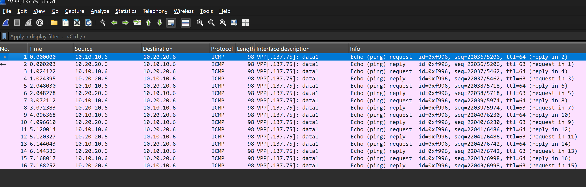

# VPP to Wireshark Bridge

[](LICENSE-2.0.txt)
[](https://github.com/wapxmas/vpp_wireshark_bridge/releases/)
[](https://github.com/wapxmas/vpp_wireshark_bridge/graphs/commit-activity)

> *A bridge between VPP (Vector Packet Processing, fd.io) and Wireshark, allowing you to view traffic from VPP interfaces in Wireshark through the extcap interface, even if VPP and Wireshark are on different machines.*

English | [Русский](README.md)

<div align="center">
  <h1 style="font-size: 36px; font-weight: bold; color: #2c3e50;">
    🔄 VPP to Wireshark Bridge
  </h1>
</div>

## 📋 Table of Contents
- [Overview](#overview)
- [Features](#features)
- [Architecture](#architecture)
- [Connection Types](#connection-types)
- [Requirements](#requirements)
- [Quick Start](#quick-start)
- [Installation](#installation)
  - [VPP Plugin Installation](#vpp-plugin-installation)
  - [VPP Agent Installation](#vpp-agent-installation)
  - [Python Bridge Installation](#python-bridge-installation)
- [Usage](#usage)
  - [Direct Control via vppctl](#direct-control-via-vppctl)
  - [Running the VPP Agent](#running-the-vpp-agent)
  - [Using in Wireshark](#using-in-wireshark)
  - [Managing via REST API](#managing-via-rest-api)
- [Debugging](#debugging)
- [Frequently Asked Questions (FAQ)](#frequently-asked-questions-faq)
- [Troubleshooting](#troubleshooting)
- [Contributing](#contributing)
- [Authors](#authors)
- [License](#license)

## 🚀 Overview

VPP to Wireshark Bridge is a tool that allows you to analyze VPP interface traffic in Wireshark in real-time. It consists of three components:

1. **VPP Plugin** - captures interface traffic and sends it to the bridge
2. **VPP Agent** - provides a REST API for management and interface information
3. **Python Bridge** - transfers traffic from the VPP plugin to Wireshark via extcap

## 🏗️ Architecture


<div align="center">

</div>

## 🔌 Connection Types

The VPP plugin supports two types of connections for transmitting captured packets:

| Connection Type | Description | Example | Recommended for |
|----------------|----------|--------|-------------------|
| **TCP Connection** | Standard TCP connection via IP and port | `192.168.1.100:9000` | Normal environment |
| **Unix Sockets** | Local Unix sockets for fast transfer | `/var/run/wireshark.sock` | VPP inside a separate namespace |

## 📋 Requirements

- VPP (fd.io) 21.01 or higher
- Wireshark 3.4 or higher
- Python 3.6 or higher
- For Windows: pywin32 for named pipe support

## 🚀 Quick Start

```bash
# 1. Clone the repository
git clone https://github.com/wapxmas/vpp_wireshark_bridge.git
cd vpp_wireshark_bridge

# 2. Install dependencies
pip install -r vpp_agent/requirements.txt
pip install -r extcap_bridge/requirements.txt

# 3. Run the VPP agent (on the VPP machine)
./vpp_agent/vpp_agent.py --host 0.0.0.0 --port 8080

# 4. Install the extcap bridge for Wireshark (on the Wireshark machine)
# Detailed instructions in the "Python Bridge Installation" section

# 5. Open Wireshark and select the VPP interface for capture
```

## 📦 Installation

### VPP Plugin Installation

1. Copy the `vpp_plugin/wireshark_bridge` directory to the `src/plugins` directory of your VPP source code.
2. Add `wireshark_bridge` to the plugin list in the `src/plugins/CMakeLists.txt` file:
   ```cmake
   add_subdirectory(wireshark_bridge)
   ```
3. Rebuild VPP:
   ```bash
   make build
   make install
   ```

### VPP Agent Installation

1. Copy the `vpp_agent` directory to the VPP machine.
2. Install the necessary dependencies:
   ```bash
   pip install -r vpp_agent/requirements.txt
   ```
3. Make the agent file executable:
   ```bash
   chmod +x vpp_agent/vpp_agent.py
   ```
4. Run the agent:
   ```bash
   ./vpp_agent/vpp_agent.py --host 0.0.0.0 --port 8080 --debug
   ```

#### VPP Agent Launch Parameters

| Parameter | Description | Default Value |
|----------|----------|------------------------|
| `--host IP` | IP address to listen on | 0.0.0.0 |
| `--port PORT` | Port to listen on | 8080 |
| `--debug` | Enable detailed logging | False |
| `--vppcmd COMMAND` | Command for interacting with VPP | vppctl |
| `--unix-socket PATH` | Path to Unix socket for proxy connection | None |
| `--bridge-address ADDR` | Bridge address for proxy connection | None |

### Python Bridge Installation

<details>
<summary>Instructions for Linux</summary>

```bash
# Create a separate directory for the Python script and virtual environment
mkdir -p ~/vpp_wireshark_bridge
cp extcap_bridge/vpp_extcap_bridge.py ~/vpp_wireshark_bridge/
cd ~/vpp_wireshark_bridge/
python3 -m venv .env
source .env/bin/activate
pip install -r /path/to/extcap_bridge/requirements.txt
deactivate

# Copy the wrapper script to the extcap directory
# For x86_64 architecture:
sudo cp extcap_bridge/vpp_bridge_wrapper.sh /usr/lib/wireshark/extcap/
sudo chmod +x /usr/lib/wireshark/extcap/vpp_bridge_wrapper.sh

# For ARM64 architecture:
sudo cp extcap_bridge/vpp_bridge_wrapper.sh /usr/lib/aarch64-linux-gnu/wireshark/extcap/
sudo chmod +x /usr/lib/aarch64-linux-gnu/wireshark/extcap/vpp_bridge_wrapper.sh
```
</details>

<details>
<summary>Instructions for macOS</summary>

```bash
# Create a separate directory for the Python script and virtual environment
mkdir -p ~/vpp_wireshark_bridge
cp extcap_bridge/vpp_extcap_bridge.py ~/vpp_wireshark_bridge/
cd ~/vpp_wireshark_bridge/
python3 -m venv .env
source .env/bin/activate
pip install -r /path/to/extcap_bridge/requirements.txt
deactivate

# Copy the wrapper script to the extcap directory
sudo cp extcap_bridge/vpp_bridge_wrapper.sh /Applications/Wireshark.app/Contents/MacOS/extcap/
sudo chmod +x /Applications/Wireshark.app/Contents/MacOS/extcap/vpp_bridge_wrapper.sh
```
</details>

<details>
<summary>Instructions for Windows</summary>

```batch
REM Create a separate directory for the Python script and virtual environment
mkdir "%USERPROFILE%\vpp_wireshark_bridge"
copy extcap_bridge\vpp_extcap_bridge.py "%USERPROFILE%\vpp_wireshark_bridge\"
cd "%USERPROFILE%\vpp_wireshark_bridge"
python -m venv .env
.env\Scripts\activate
pip install -r path\to\extcap_bridge\requirements.txt
deactivate

REM Copy the wrapper script to the extcap directory
copy extcap_bridge\vpp_bridge_wrapper.bat "%APPDATA%\Wireshark\extcap\"
```
</details>

## 🔧 Usage

### Direct Control via vppctl

<details>
<summary>vppctl command examples</summary>

```bash
# Enable traffic transmission for an interface via TCP socket (IP:port)
vppctl wireshark bridge enable GigabitEthernet0/0/0 192.168.1.100:9000

# Enable traffic transmission for an interface via Unix socket
vppctl wireshark bridge enable GigabitEthernet0/0/0 /var/run/wireshark.sock

# Enable transmission of incoming traffic only via TCP socket
vppctl wireshark bridge enable GigabitEthernet0/0/0 192.168.1.100:9000 rx

# Disable traffic transmission for an interface
vppctl wireshark bridge disable GigabitEthernet0/0/0

# View traffic transmission statistics
vppctl wireshark bridge stats
```
</details>

### Running the VPP Agent

```bash
# On the VPP machine
./vpp_agent/vpp_agent.py --host 0.0.0.0 --port 8080 --debug
```

### Using in Wireshark

1. Launch Wireshark.
2. In the interface list, you will see VPP interfaces.
3. Select the desired interface.
4. Click "Start" to begin capturing packets.

### Managing via REST API

<details>
<summary>REST API request examples</summary>

```bash
# Get list of interfaces
curl http://vpp-host:8080/interfaces

# Enable traffic transmission via TCP socket (both directions)
curl -X POST -H "Content-Type: application/json" -d '{"interface":"GigabitEthernet0/0/0","bridge_address":"wireshark-host:9000","direction":"both"}' http://vpp-host:8080/enable

# Disable traffic transmission
curl -X POST -H "Content-Type: application/json" -d '{"interface":"GigabitEthernet0/0/0"}' http://vpp-host:8080/disable

# Get statistics
curl http://vpp-host:8080/stats
```
</details>

## 🐞 Debugging

<details>
<summary>VPP Agent Debugging</summary>

```bash
./vpp_agent/vpp_agent.py --debug
```

Logs are saved to standard output.
</details>

<details>
<summary>Python Bridge Debugging</summary>

```bash
python3 extcap_bridge/vpp_extcap_bridge.py --debug --vpp-host=vpp-host --vpp-port=8080 --direction=both --capture --interface=vpp_1 --fifo=/tmp/wireshark_pipe
```

Logs are saved to the `vpp_extcap_bridge.log` file in the temporary files directory.
</details>

<details>
<summary>Debugging Tools</summary>

**UDP Listener (utils/udp_listener.py)** - utility for receiving and displaying UDP packets:
```bash
python3 utils/udp_listener.py --port 9000 --show-hex
```
</details>

## ❓ Frequently Asked Questions (FAQ)

<details>
<summary>Q: How can I check if the VPP agent is working correctly?</summary>

A: Make a request to the API to get a list of interfaces:
```bash
curl http://vpp-host:8080/interfaces
```
You should see a list of available VPP interfaces.
</details>

<details>
<summary>Q: What is the minimum impact on VPP performance when using the plugin?</summary>

A: The plugin is optimized for minimal impact on the core functionality of VPP. In our tests, performance decreases by no more than 1-2% with the plugin enabled.
</details>

<details>
<summary>Q: Is traffic capture supported on virtual interfaces?</summary>

A: Yes, the plugin supports traffic capture on all types of VPP interfaces, including virtual ones.
</details>

## 🔧 Troubleshooting

<details>
<summary>Problem: VPP interfaces are not displayed in Wireshark</summary>

**Solution:**
1. Make sure the VPP agent is running and accessible over the network.
2. Check the path to the script in the wrapper file.
3. Check firewall settings.
4. Restart Wireshark.
</details>

<details>
<summary>Problem: Packets are not being transmitted from VPP to Wireshark</summary>

**Solution:**
1. Make sure traffic transmission is enabled for the selected interface.
2. Check that there is active traffic on the interface.
3. Check UDP connectivity between machines.
4. Check the VPP agent and bridge logs.
</details>

<details>
<summary>Problem: UDP packets are blocked on Windows</summary>

**Solution:**
Add a firewall rule to allow incoming UDP traffic:
```batch
netsh advfirewall firewall add rule name="Allow UDP Port 9000" dir=in action=allow protocol=UDP localport=9000
```
</details>

## 💻 Contributing

Contributions are welcome! Please follow these steps:

1. Fork the repository
2. Create a branch for your feature (`git checkout -b feature/amazing-feature`)
3. Commit your changes (`git commit -m 'Add amazing feature'`)
4. Push to your branch (`git push origin feature/amazing-feature`)
5. Open a Pull Request

For more information, see the [CONTRIBUTING_EN.md](CONTRIBUTING_EN.md) file.

## 👥 Authors

* **Sergey Yashin** - *Initial work* - [GitHub profile](https://github.com/wapxmas)

See also the list of [contributors](https://github.com/wapxmas/vpp_wireshark_bridge/contributors) who have contributed to this project.

## 📄 License

This project is licensed under the Apache License 2.0 - see the [LICENSE](LICENSE-2.0.txt) file for details.

---

<div align="center">
🌟 <a href="https://github.com/wapxmas/vpp_wireshark_bridge">Star us on GitHub</a> and stay updated! 🌟
</div> 